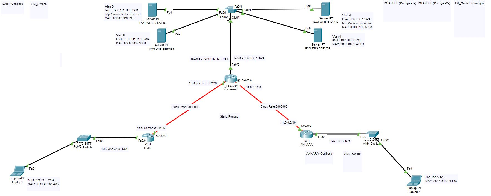

# ***Network-Security-Bootcamp***

### **Proje 1** : 
    IPv4 omurga ve IPv6 omurga kendi içlerinde statik routing ile haberleşelebilmeli.
    ISTANBUL lokasyonunda gerekli L2 düzenlemeler sağlanmalı
    Serverlara sadece verdikleri servis portundan ulaşılmalı
<br>
<div align="center">



</div>
<br>

## **Yapılanlar**

- Toplojiyi çizdim.

- End Device'ların IP, GW ve DNS ayarlarını yaptım.

- Switch ve Router'ların Basic ayarlarını yaptım
<br>Bütün cihazlar için;
	- ***Password:*** ```saim```
	- ***Secret:*** ```cisco```

- Routerların Interface ayarlarını yaptım.
    - ISTANBUL Routerında SubInt ayarlarını yaptım.
    - Ping testlerini yaptım bir sorun yok.

- Statik Route ayarlarını yaptım.
    - Sub int'lere kadar ping atabiliyor.

- Serverların bulunduğu Switch'te VLAN ayarlarını yaptım.
    - Artık end device'lar server'lara erişip ping atabiliyor.

- Istanbul network'une IPv4 ve IPv6 omurgalarının erişimini kısıtlamak için Port Base ACL yazdım.
    - Artık Izmir ve Ankara networklerindeki cihazlar serverlara icmp paket gönderemiyor.
    - TCP ve UDP izinleri verildi.

- Network güvenliğini sağlamak için MAC adresi düzeyinde Port Security ayarlarını yaptım.

- Izmir ve Ankara networklerine 2 tane end device koydum bu sayede ayarları doğru yapıp yapmadığımı kontrol ettim.
    - Test Cihazlarını sildim

- Bütün networklerdeki kullanılmayan portları kapattım.

- Son kontrolleri yaptım.

<div align="center">

----------------------------------------
Yaptığım tüm işlemleri proje üstüne not aldım görüntü kirliliği olmasın diye "<" kullanarak gizledim. O yüzden buraya detaylı olarak yazmıyorum.

----------------------------------------
</div>


### **Proje 2** :
    IPv4 omurga ve IPv6 omurga kendi içlerinde OSPF ile haberleşelebilmeli.
    ISTANBUL lokasyonunda gerekli L2 düzenlemeler sağlanmalı
    Serverlara sadece verdikleri servis portundan ulaşılmalı


<br>
<div align="center">


</div>
<br>

## **Yapılanlar**
- Topolojiyi Çizdim ve cihazların IP Configlerini yaptım.
   - ***Password:*** ```saim```
   - ***Secret:*** ```cisco```

- Ist_Switch'te Vlan ayarları yapıldı.
   - ping testleri yapıldı.

- OSPF ayarlarını yapıyorum.

- IPv6 ve IPv4 teki DNS ve WEB server ayarlarını yaptım.

- OSPF Auth yaptım.

- IPv4 tarafına port security yaptım

- Istanbul tarafına IPv4 Port Base ACL uyguladım. Laptop 2, TCP ve UDP izni var ICMP paket atamıyor.
- Aynısını IPv6 tarafında Laptop 1 için uyguladım.

- IPv6, IPv4 omurgalarında ve Istanbul tarafında Port security uyguluyorum ve kullanılmayan portları kapatıyorum.